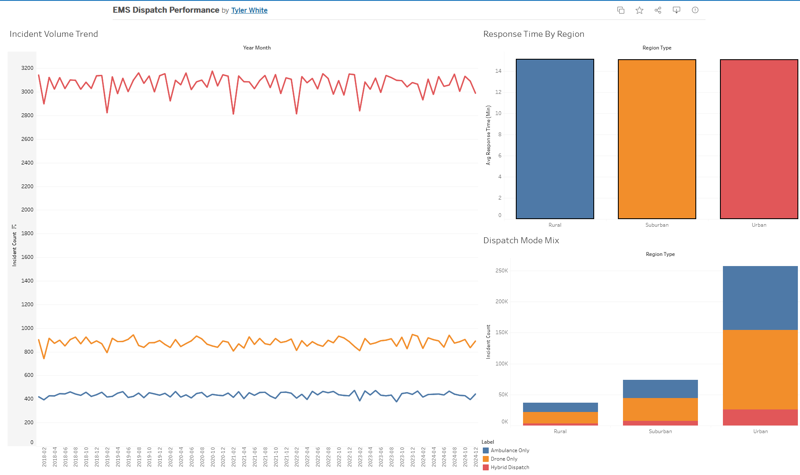

# EMS Dispatch Response Analysis

A data analysis project examining emergency dispatch response times, incident
volume patterns, and dispatch resource selection (ambulance vs. drone vs.
hybrid) using a large simulated dispatch dataset.

**Live dashboard:** *https://public.tableau.com/app/profile/tyler.white2393/viz/EMSDispatchPerformance/EMSDispatchPerformanceDashboard?publish=yes*



## Business Question

How does emergency dispatch response time vary by region, incident type, and
operational conditions, and can we predict which dispatch resource (ambulance,
drone, or both) should be sent to a given incident?

## Data Source

[Emergency Service Routing with Timestamps](https://www.kaggle.com/) dataset
via Kaggle — 368,065 simulated dispatch records spanning 2018–2024, comparing
ambulance vs. drone-based emergency response. *(Add the exact Kaggle listing
URL here.)*

**Important caveat, stated up front:** this is a synthetic/simulated dataset,
not real-world incident data. It has no street address or latitude/longitude
— only a coarse `Region_Type` field (Urban / Suburban / Rural) — so the
"geographic trends" analysis here works at the region level rather than a
true GIS incident map. With real fire/EMS records, the same pipeline would
extend directly to point-level mapping in ArcGIS or Tableau's native
mapping. Records also occur at a fixed ~10-minute interval rather than
matching real-world incident timing, which is disclosed rather than
presented as a seasonal pattern.

## Key Findings

- **368,065 dispatch records** analyzed, 2018–2024.
- **Response time:** mean 15.06 min, median 15.01 min, 90th percentile 21.43
  min, 95th percentile 23.26 min.
- **No statistically significant driver of response time was found** in this
  dataset. Region type (ANOVA p = 0.39), incident type (p = 0.17), distance
  to incident (r ≈ 0.001), and traffic congestion (r ≈ 0.000) all showed no
  meaningful relationship with response time, and AI vs. human dispatch
  coordinators performed statistically identically (p = 0.15). Full detail
  in `reports/statistical_analysis.md`.
- **This is a data-quality finding, not a null result to bury:** in a real
  operational dataset, distance and traffic would be expected to matter. The
  absence of any signal here indicates response time was likely simulated
  independently of the other fields — worth catching before it's presented
  to stakeholders as if it were actionable.
- **Dispatch mode prediction:** a Random Forest classifier predicting
  Ambulance/Drone/Hybrid dispatch reached 49.9% accuracy — statistically
  identical to always guessing the majority class (49.9%). Cross-checking
  against the "obvious" drivers (e.g., drone dispatched only when
  `Drone_Availability = Available`) confirmed dispatch mode is also
  effectively independent of the operational fields in this dataset. Full
  detail in `reports/predictive_model.md`.

## Repository Structure

```
├── data/
│   ├── raw/                 # original CSV (gitignored — see Data Source)
│   ├── processed/           # cleaned data + a 5,000-row sample for the repo
│   └── tableau/              # small aggregated tables that feed the dashboard
├── scripts/
│   ├── 01_data_cleaning.py
│   ├── 02_eda_response_time.py
│   ├── 03_statistical_analysis.py
│   ├── 04_predictive_model.py
│   └── 05_export_for_tableau.py
├── reports/
│   ├── figures/              # all generated charts
│   ├── eda_summary.md
│   ├── statistical_analysis.md
│   ├── predictive_model.md
│   └── executive_summary.md  # one-page, stakeholder-facing writeup
├── dashboards/
│   └── dashboard_screenshot.png  # screenshot of the published Tableau dashboard
├── requirements.txt
└── .gitignore
```

## How to Reproduce

```bash
# 1. Clone this repo and enter it
git clone https://github.com/<your-username>/ems-response-analysis.git
cd ems-response-analysis

# 2. Set up a virtual environment
python -m venv venv
venv\Scripts\activate        # Windows
# source venv/bin/activate   # Mac/Linux

# 3. Install dependencies
pip install -r requirements.txt

# 4. Download the raw dataset from Kaggle (see Data Source above) and place it at:
#    data/raw/emergency_service_routing_with_timestamps.csv

# 5. Run the pipeline in order
python scripts/01_data_cleaning.py
python scripts/02_eda_response_time.py
python scripts/03_statistical_analysis.py
python scripts/04_predictive_model.py
python scripts/05_export_for_tableau.py
```

Each script prints its progress and writes its outputs to `data/processed/`,
`data/tableau/`, or `reports/`.

## Skills Demonstrated

- Data cleaning and validation on a large dataset (368K rows): null handling,
  dtype optimization, range checks
- Exploratory analysis of response times, incident volumes, and geographic
  (region-level) trends
- Statistical hypothesis testing: t-test, ANOVA, Pearson correlation,
  chi-square test of independence
- Data visualization: 11 charts covering distributions, trends, and
  comparisons
- Dashboard development in Tableau
- Predictive modeling: Random Forest classifier, with honest evaluation
  against a baseline rather than an inflated headline metric
- Clear written communication for both technical and non-technical audiences
  (`reports/executive_summary.md`)

## Author

*Tyler White*
